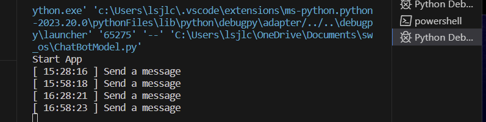

# 2023-oss-hw2
[Telegram] schedule alarm bot 개발

## ✨작동 결과
- **30분마다 채널에 알람이 울리는 봇(오후 11시 부터 아침 6시까지는 메시지 X)**

- **채널 메시지 전송 시 Terminal창 결과**

날짜와 시간(datetime)을 문자열로 출력하는 코드 작성, 텔레그램 메시지 전송 시 전송 시간을 터미널 창에 띄워줌
    time = now.strftime("%H:%M:%S")
    print("[",time,"]","Send a message")
    await send_telegram_message()

